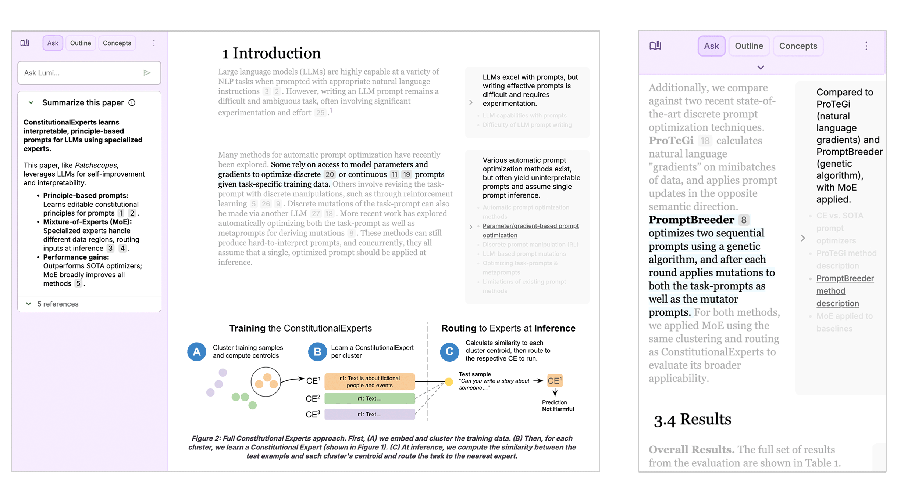

# Welcome to Elowen

[Elowen](https://lumi.withgoogle.com) uses AI to help you quickly read and understand [arXiv papers](https://arxiv.org/). Features include:

- ✏️ **AI-augmented annotations** - read summaries at multiple granularities
- 🔖 **Smart highlights** - highlight text + ask questions
- 🖼️ **Figure explanations** - ask Elowen about images in the paper

[Demo](https://lumi.withgoogle.com) | [Medium article](https://medium.com/people-ai-research/read-smarter-not-harder-with-elowen-6a1a8210ccc7) | [GitHub](https://github.com/AJI1026/Elowen)



*Please note that Elowen can only currently process arXiv papers under a Creative Commons license.*

## Running Elowen locally

Local stack is **FastAPI + SQLite + filesystem images** (no Firebase).

### Quick start (recommended)

```bash
# From repo root — first run creates venv & installs deps
chmod +x start-api.sh start-dev.sh   # once

./start-api.sh      # API only → http://127.0.0.1:8000
# or
./start-dev.sh      # API + frontend → http://localhost:4201
```

Optional once: set your API key in the app **Settings** (saved to
`data/settings.json`, loaded automatically on next start). You can also copy
`backend/settings.example.json` → `data/settings.json` and fill in the key.
Server-side `ELOWEN_API_KEY` / `api_config.py` remains an optional fallback for
headless / CI use. **Never commit** real API keys — run `./scripts/setup-git-hooks.sh`
once so pre-commit blocks them.

Docker alternative: `docker compose up --build`

Data lives under `./data/` (SQLite + `images/` + `settings.json`). Seed fixtures
in `backend/seed/` load on first boot. Imported papers and reading history live
in SQLite (`paper_library` + paper tables), not browser storage.

The API key in Settings is used for paper import and for in-paper Ask /
highlights (persisted in `data/settings.json`, not browser storage).

### Frontend only (API already running)

```bash
cd frontend
npm install   # once
cp index.example.html index.html   # once
npm run start
```

Webpack proxies `/api` → `http://127.0.0.1:8000`. Open http://localhost:4201.

Demo collection: http://localhost:4201/#/collections/test

### Toward a downloadable desktop app

Build a macOS/Windows/Linux installer (Electron + bundled API):

```bash
./scripts/build-desktop.sh
```

Artifacts appear in `desktop/release/` (e.g. `.dmg`). See [`desktop/README.md`](desktop/README.md).

User data (SQLite + images) is stored under the OS app-support directory after install.


### Storybook stories

To view [Storybook](https://storybook.js.org/docs) stories for Elowen:

```
npm run storybook
```

Then, view the stories at http://localhost:6006.

### Local paper import and debugging

The import script in `scripts/import_papers_local.py` can be used to import a
set of papers for local debugging.

The locally imported papers can be rendered in `elowen_doc.stories.ts`
via Storybook.

## Deploying the Elowen app

To deploy the web app via App Engine, add an
[app.yaml](https://cloud.google.com/appengine/docs/standard/reference/app-yaml?tab=node.js)
configuration and
[set your Google Cloud project](https://cloud.google.com/sdk/gcloud/reference/config/set).

```bash
npm run deploy:prod
```

The Python import/LLM logic lives under `functions/` and is loaded by the
FastAPI backend; see `functions/README.md`.

## License and Disclaimer

All software is licensed under the Apache License, Version 2.0 (Apache 2.0).
You may not use this file except in compliance with the Apache 2.0 license.
You may obtain a copy of the Apache 2.0 license at:
https://www.apache.org/licenses/LICENSE-2.0.

Unless required by applicable law or agreed to in writing, all software and
materials distributed here under the Apache 2.0 licenses are distributed on an
"AS IS" BASIS, WITHOUT WARRANTIES OR CONDITIONS OF ANY KIND, either express or
implied. See the licenses for the specific language governing permissions and
limitations under those licenses.

This is not an official Google product.

Elowen is a research project under active development by a small
team. If you have suggestions or feedback, feel free to
[submit an issue](https://github.com/AJI1026/Elowen/issues).

Copyright 2025 DeepMind Technologies Limited.

## Acknowledgments

Elowen was designed and built by Ellen Jiang, Vivian Tsai, and Nada Hussein.

Special thanks to Andy Coenen, James Wexler, Tianchang He, Mahima Pushkarna, Michael Xieyang Liu, Alejandra Molina, Aaron Donsbach, Martin Wattenberg, Fernanda Viégas, Michael Terry, and Lucas Dixon for making this experiment possible!
